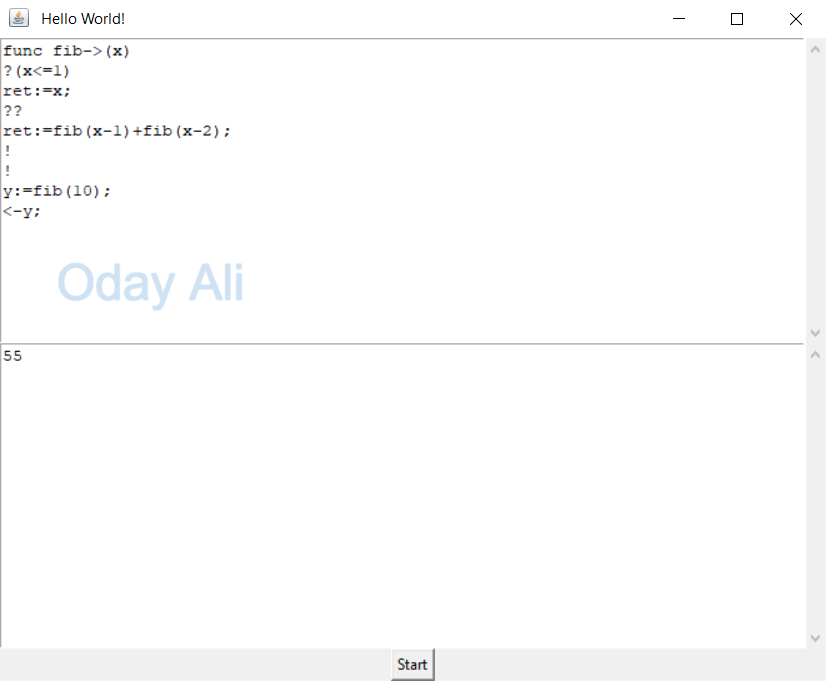
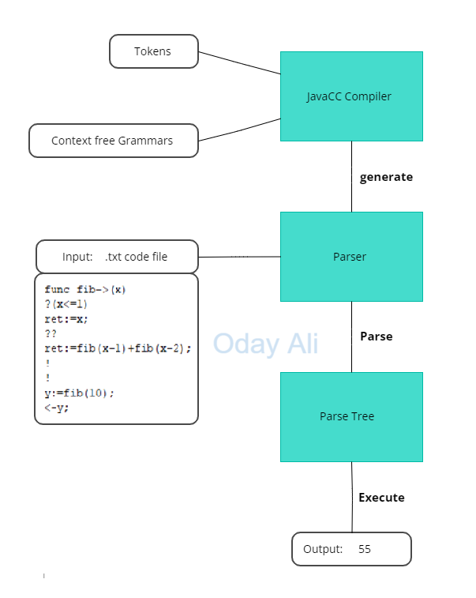

# Q Interpreter: A JavaCC-Based Language Interpreter

## Description

The Q Interpreter is a Java-based project developed using JavaCC, aimed at interpreting the Q programming language. This project provides a parser capable of understanding Q code through the utilization of tokens and grammars defined in a `.jj` file. JavaCC then generates a set of files that serve as the lexical and syntax analyzers, constructing a parse tree from the input code.

At its core, the Q Interpreter converts Q code into Java programs. This conversion process involves utilizing the generated parser to construct a parse tree, where each node represents a language construct such as statements, conditions, loops, or functions. The parse tree is composed of Java objects of the `TreeNode` class, an abstract class containing a list of children nodes and an abstract `execute` function that leverages the current context to execute the corresponding node.

The development of the Q Interpreter involved defining context-free grammars in the `.jj` file, where JavaCC facilitates the inclusion of code during the parsing process. This is where the construction of tree nodes takes place, ensuring the representation of Q code in the form of a parse tree.

Through this project, I delved into the realm of compiler design, exploring how programming languages function and culminating in the development of a sophisticated interpreter for a custom language. The Q Interpreter serves as a testament to my exploration and understanding of compiler design principles and language interpretation techniques.

## Images

### Output

### Flow Chart

## Portfolio Website Description

### Introduction

Every programmer's journey often begins with a curiosity about how programming languages work. My exploration into this field led me to embark on a journey of discovery, culminating in the development of the Q Interpreter. As I pondered the intricacies of language design and implementation, I sought to create a tool that could interpret a language of my own creation – the Q programming language.

### Description

The Q Interpreter project represents a significant milestone in my exploration of compiler design and language interpretation. Leveraging the power of JavaCC, I developed a parser capable of understanding Q code by defining tokens and grammars in a `.jj` file. Through the magic of JavaCC, this input file was transformed into a set of files serving as the lexical and syntax analyzers, enabling the construction of a parse tree from Q code.

The heart of the Q Interpreter lies in its ability to convert Q code into Java programs. This conversion process relies on the generated parser to construct a parse tree, where each node represents a language construct such as statements, conditions, loops, or functions. These nodes are instantiated as Java objects of the `TreeNode` class, which encapsulates a list of children nodes and an abstract `execute` function that facilitates code execution within the current context.

The development of the Q Interpreter involved meticulous crafting of context-free grammars in the `.jj` file, where JavaCC seamlessly integrates code to construct tree nodes during the parsing process. This ensures the faithful representation of Q code as a parse tree, ready for interpretation and execution.

As I reflect on this project, I recognize its significance in my journey as a programmer. It stands as a testament to my curiosity and determination to understand the intricacies of compiler design and language interpretation. Through the Q Interpreter, I not only explored the depths of compiler theory but also honed my skills in software development and problem-solving.

What makes the Q programming language special is its foundation in exploration and understanding of how programming languages function. In addition, I intentionally designed Q with very concise tokens, drawing inspiration from Python, to minimize the need for excessive typing when forming programs. This design choice aims to create an easy-to-use programming language, making it accessible to both novice and experienced programmers alike. By combining simplicity with the principles of language design and interpretation, Q offers a unique platform for experimentation and learning in the realm of programming language development.
